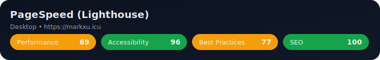
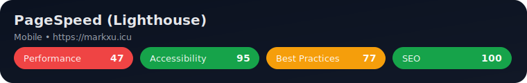

# Mark 的个人网站（Mark-blog）

个人网站与博客源码，基于 Vite + React 构建，部署于 Vercel。包含博客、时间线、RSS、美化的订阅源页面、评论系统等能力。
本项目作为个人练手项目，如有bug欢迎提出！

## PageSpeed Insights

**Desktop**

**Mobile**

## Roadmap

- [x] 评论系统（Twikoo 1.7.0，支持图片上传）
- [x] 博客发布（列表 / 详情 / 搜索 / TOC）
- [x] RSS 订阅（仅博客，自动生成）
- [x] 订阅源美化（RSS 使用 HTML 代替 XSL 美化方法（部分浏览器已不支持））
- [x] SEO 优化：预渲染、元数据（OG/Twitter/Canonical）、结构化数据、Sitemap/Robots、资源提示、hreflang
- [x] 关于页面
- [x] 时间线页面
- [x] 图床接入（img.markxu.icu）
- [x] 生活页面（随笔/相册）
- [x] 影视页面（CSV 默认 + TMDB 增强切换）
- [ ] 游戏页面（游玩记录，当前路由为施工页）

## 快速开始

### 本地开发

1. 安装 pnpm 与 Node（建议 LTS）
2. 克隆仓库并安装依赖
   - `pnpm install`
3. 配置环境变量
   - 复制 `apps/web/.env.example` 为 `apps/web/.env.local`
   - 在 `apps/web/.env.local` 中填写：
     - `VITE_TWIKOO_ENV_ID=<你的 Twikoo 环境 ID 或后端地址（例如 https://comments.example.com/api/twikoo）>`
     - `VITE_TMDB_API_TOKEN=<你的 TMDB Read Access Token>`（可选，用于 TMDB 增强模式）
     - `VITE_TMDB_API_KEY=<你的 TMDB API Key>`（可选，作为 token 的备选）
4. 启动与构建
   - 启动开发：`pnpm -F web dev`
   - 生产构建：`pnpm -F web build`
   - 本地预览：`pnpm -F web preview`

### Vercel 部署

1. 从 GitHub 导入仓库
2. 将项目根目录设置为 `apps/web`
3. 构建配置
   - Install Command: `pnpm install`
   - Build Command: `pnpm build`
   - Output Directory: `dist`
4. 环境变量
   - `VITE_TWIKOO_ENV_ID`：你的 Twikoo 环境 ID 或私有部署后端地址（需指向 `/api/twikoo`）
5. 绑定自定义域名（推荐），确保评论与资源可正常访问

## 使用声明

- 允许在遵循本仓库许可证的前提下，使用本代码进行个人部署与学习。
- 站点内本人创作的文字、图片等内容仅授权在本站展示，禁止在非本人站点转载、抓取或二次分发。
- 代码整体遵循仓库根目录下的 GPL-3.0 许可证（见 `LICENSE`），如有子包单独声明，以其声明为准。

## 目录结构（简要）

- `apps/web`：网站前端（Vite + React）
- `content/`：文章与时间线数据
- `packages/`：共享配置与工具（如 ESLint 配置）

---

欢迎提出 Issue 或 PR 一起完善！
仓库地址：https://github.com/MarkXuJQ/Mark-blog
